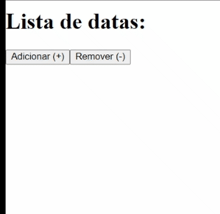

# [M1S10] Ex 3 - useReducer prática

## Resultado:

## Exercício:

a) Criar uma tela contendo: (em anexo exemplo de tela)

- Título: Lista de datas
- Botão adicionar
- Botão remover
- Lista das datas

b) Criar um useReducer com funções:

Adicionar uma nova data na lista. Deve ser usado `new Date()` para obter a data a ser adicionada. Utilize funções de manipulação de listar para fazer a adição como ultimo elemento da lista.
Remover o ultimo item da lista. Utilize funções de manipulação de listar para fazer a remoção.
