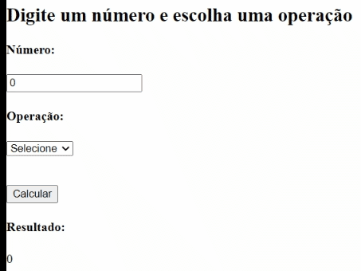

# Semana 10 - Exercício 04

## Resultado:



## Exercício:

a) Implemente uma tela contendo:

- 1 input do tipo number;
- 1 select com as opções: Somar, Subtrair, Multiplicar e Dividir;
- 1 botão para confirmar a operação;
- 1 campo para apresentar o resultado, pode ser um ´p´.
- Utilizar useState para controlar os valores selecionados/digitados do input e select

b) Desenvolver lógica usando useReducer para calcular as operações e armazenar o resultado.

- O valor inicial do useReducer deve ser 0;
  Exemplo:

```
const [state, dispatch] = useReducer(reducer, { result: 0 });
```

- A função espera receber um novo valor que será usado para efetuar a operação utilizando o valor que ela tinha anteriormente.
  Exemplo:

```
             const reducer = (state, action) => {
                      switch (action.type) {
                        case 'somar':
                          return { result: state.result + action.payload };
                        case 'subtrair':
                          {...}
                      }
               };
```

- Deve ser validado para não permitir divisão por 0, nesse caso deve apenas ser retornado o valor anterior.

c) Ao clicar no botão deve ser chamada a função de dispatch do reducer passando o número digitado e a ação selecionada no select.
Exemplo:

```
dispatch({ type: 'somar', payload: number })
```
