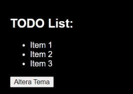

# exercicio-08-hook-context

## Resultado:

## Exercício:

Crie um contexto para armazenar o tema da aplicação escolhida pelo usuário

a) Crie um layout dividindo em componentes da forma que desejar.

- O Layout deve conter um botão para efetuar a troca de tema.
- O background, cor de fontes, entre outros deve ser definido de acordo com o tema escolhido pelo usuário.

b) Crie 2 temas customizados (light e dark) contendo cor principal e cor secundária.

c) Crie um contexto para armazenar o tema que o usuário escolheu.
