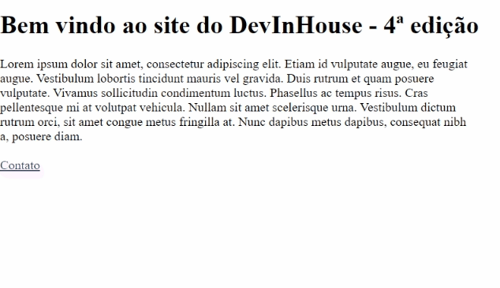

# exercicio-10-react-router

## Resultado:



## Exercício:

Criar navegação entre páginas:

a) Crie um componente home adicionando informações de bem vindo e no footer um link para o componente de contatos.
Exemplo:

```
<Link to="/contatos">Contatos</Link>
```

b) Crie um componente contatos contendo informações para contato e um link para voltar para home

c) Crie um arquivo contento as configurações das rotas

- Rota '/' deve acessar o componente home
- Rota '/contatos' deve acessar o componente contatos
- Qualquer outra roda deve ser redirecionado para home

d) No app adicione a configuração de rotas para renderizar os componentes.
