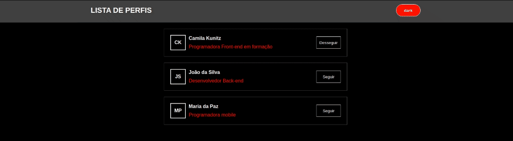
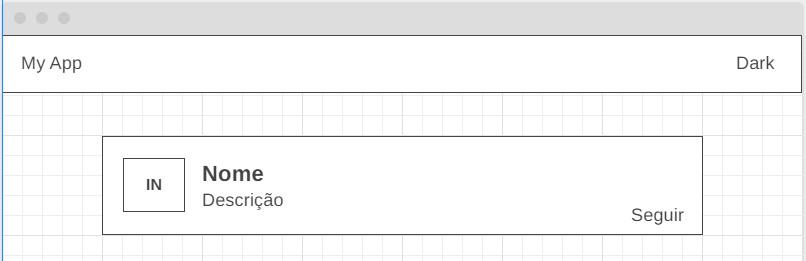

# exercicio-01-styled-components

## Resultado:

## Exercício:

### Parte 1:

Vamos criar uma aplicação para listar perfis e estilizar ela utilizando Styled Components.
Estilos e cores são à sua escolha, tem um exemplo em anexo mas é apenas uma sugestão.

**Os itens a serem feitos estão listados no checklist abaixo:**

Após esse passo você terá a estrutura/layout básico do seu projeto criada

- 1 - Criar um componente de Navbar contendo o nome da aplicação e um botão para alterar o tema (estilizar ela utilizando Styled Components)

- 2 - Criar um componente para o card contendo iniciais do nome do usuário, nome, descrição e um botão de seguir/desseguir, deve ser utilizado duas cores diferentes para o botão, se estiver seguindo será uma cor, se não estiver deve ser outra cor (estilizar ela utilizando Styled Components)

- 3 - No App criar um state para armazenar a lista de dados contendo: id, nome, descricao, seguindo. Ex: const data = [{id: 1, nome: 'Nome do Fulano', descricao: 'Descrição do funalo', seguindo: false}] [dados, setDados] = useState(data)

- Criar no app uma função para alterar o seguir/desseguir quando o usuário clicar no botão. Essa função vai receber o id e uma prop para seguir ou desseguir, pode ser utilizado filter, spread ou o que preferir para atualizar a lista com a prop seguir atualizada. Essa função deve ser passada como prop para o card

- No App percorrer a lista do state criada no item 3 anterior renderizando o card criado no item 2

- No Card criado no item 2 ajustar para que ele receba as informações como props através da renderização da lista, se atentar ao texto do botão seguir que se ele já estiver seguindo deve ser "desseguir" e adicionar o click no botão

### Parte 2:

Vamos adicionar o controle de tema da nossa aplicação

**Os itens a serem feitos estão listados no checklist abaixo:**

Após esse passo você terá o projeto com um tema definido, mas ele ainda não estará refletindo na sua aplicação.

- 1 - Criar um arquivo de temas contendo um tema dark e um light. Esse tema deve conter: cor do background, cor primária e cor secundária

- 2 - Criar um style global dentro do arquivos de temas removendo margin e definir box-sizing: border-box

- 3 - No App adicionar o style global

- 4 - No App adicionar um useState para armazenar se está sendo usado o tema dark que deve ser iniciado com false

- 5 - Adicionar o ThemeProvider e o tema passado para ele deve ser com base no valor do useState criado no item 4

- 6 - Adicionar o componente da navbar criada no exercício anterior e passar a informação de se é o tema dark que está selecionado e a função para alterar o tema

- 7 - Na navbar utilizar as props recebidas para alterar o texto do botão e ao clicar atualizar o state para o estado contrário do que estava

### Parte 3:

**Continuação do exercício 2**

Vamos utilizar os tema na nossa aplicação

**Os itens a serem feitos estão listados no checklist abaixo:**

Após esse passo seu projeto deverá estar funcionando com a troca do tema

- 1 - No componente da navbar adicionar o background utilizando a cor definida no tema

- 2 - No componente da navbar adicionar o título da aplicação com a cor definida na cor primária

- 3 - No componente da navbar adicionar o background do botão com a cor secundária e o texto com a cor primária

- 4 - No componente do card adicionar o background com a cor definida no tema

- 5 - No componente do card adicionar as iniciais com a cor primária

- 6 - No componente do card adicionar o nome com a cor primária e a descrição com a cor secundária

- 7 - No componente do card adicionar o botão de seguir/desseguir para utilizar as cores do tema, se quiser pode criar novas cores no tema, ou utilizar as secundárias e primárias
