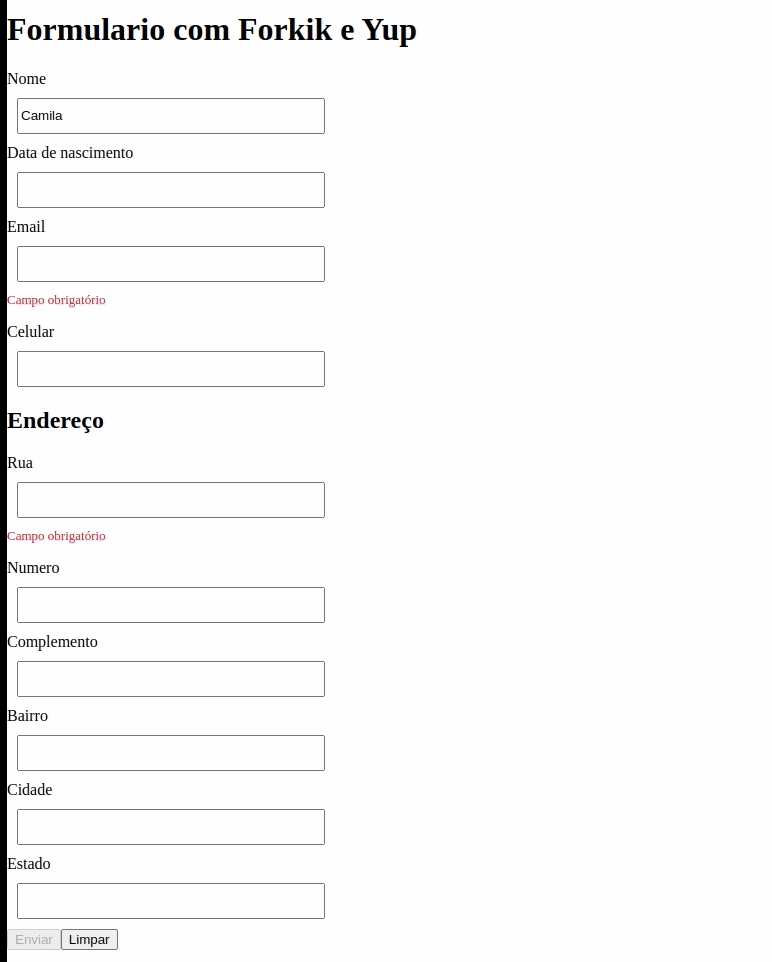

# exercicio-02-formulario

## Resultado

## Exercício

### Parte 1

**Vamos praticar a criação de formulários utilizando Formik**
Vamos criar um fomulário simulando a criação de um cadastro em um site

**Os itens a serem feitos estão listados no checklist abaixo:**

- Criar um componente novo para esse formulário contendo Nome, data de nascimento, e-mail e celular

- Adicionar nesse formulário novos campos para cadastro de endereco: rua, número, complemento, bairro, cidade e estado. Todos esses dados precisam ser adicionados à uma propriedade “endereço” no estado do Formik

- Adicionar um botão para cadastrar que ao ser clicado deve exibir no console os valores do formulário

- Adicionar um botão de limpar que deve limpar os dados preenchidos voltando para o estado inicial do formulário

### Parte 2

**Vamos praticar a validação de formulários utilizando Yup**
Vamos adicionar validações no formulário criado no exercício 4

**Os itens a serem feitos estão listados no checklist abaixo:**

- Adicione validação para que o campo nome seja obrigatório

- Adicione validação para o campo e-mail aceitar apenas e-mails com formato válido

- Adicione validação para que os campos de endereço sejam obrigatórios, exceto complemento

- Valide para que o botão de cadastrar só esteja habilitado quando o formulário estiver válido
