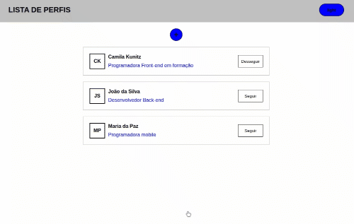

# exercicio-03-projeto-aplicado

## Resultado:

## Exercício:

### Parte 1:

Seguindo à ideia utilizada no exercício anterior vamos cria um formulário para adicionar novos perfis à lista.

**Os itens a serem feitos estão listados no checklist abaixo:**

- 1 - Criar um componente de formulário contendo dois campos: Nome e Descrição e um botão de salvar

- 2 - Adicionar estilo para o componente criado no item 1 usando styled components

- 3 - Ao clicar no botão de salvar esse item deve ser adicionado ao useState de dados criado no exercício 1

- 4 - No app criar um useState para armazenar a informação de que o cadastro está aberto ou não. Deve ser iniciado com false

- 5 - Adicionar um botão antes da lista para que o usuário tenha acesso à esse formulário criado. Ao clicar nele deve ser atualizado o estado criado no item 4 para true

- 6 - Adicionar um botão de cancelar no formulário que ao ser chamado atualiza o estado criado no item 4 para false

- 7 - Criar um modal para abrir esse formulário dentro dele. Pode ser feito de forma manual [Cook a Modal with Styled Components](https://keyholesoftware.com/2020/11/18/cook-your-own-modal-with-styled-components/) ou utilizar alguma lib. Ex: [styleld-modal-react](https://www.npmjs.com/package/styled-react-modal)

### Parte 2:

**Continuação do exercício 4**

Vamos adicionar validações em nosso formulário

**Os itens a serem feitos estão listados no checklist abaixo:**

- 1 - Adicionar validação para que o campo de nome seja obrigatório e tenha no máximo 100 caracteres

- 2 - Adicionar validação para que o campo de descrição seja obrigatório e tenha no mínimo 10 caracteres

- 3 - Adicionar as mensagens de erro nos componentes

- 4 - Desabilitar o botão de salvar enquanto tiver erros de validação no formulário
