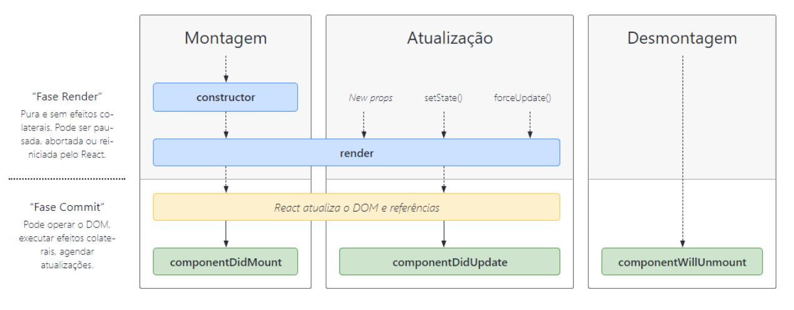

# Exercicio 08 - Classes e ciclos de vida - Teoria

Sabendo que os principais métodos de ciclos de vida de uma classe são _componentDidMount_, _componentDidUpdate_ e _componentWillUnmount_, cite em quais fases do ciclo de vida cada um desses métodos é chamado e dê um exemplo de em qual situação cada um deles pode ser utilizado.

### Resposta

- _componentDidMount_: é chamado na fase de **montagem** do componente, qunado o construtor da classe é chamado, ou seja, sempre que uma classe é instanciada. Similar ao _useEffect_ sem dependencias. Exemplo: Podemos chamar uma API para popular os dados a serem exibidos no DOM.

- _componentDidUpdate_ é chamado na fase de **atualizacao** do componente, quando as _props_ ou o estado do componente é alterado. Nao é executado na primeira atualização. Similar ao _useEffect_ com dependencias. Exemplo: Podemos executar um filtro toda vez que o valor de um campo input alterar.

- _componentWillUnmount_ é chamado na fase de **desmontagem/destrição** do componente. Exemplo: podemos neste método invalidar timers e cancelar requisições de rede;

